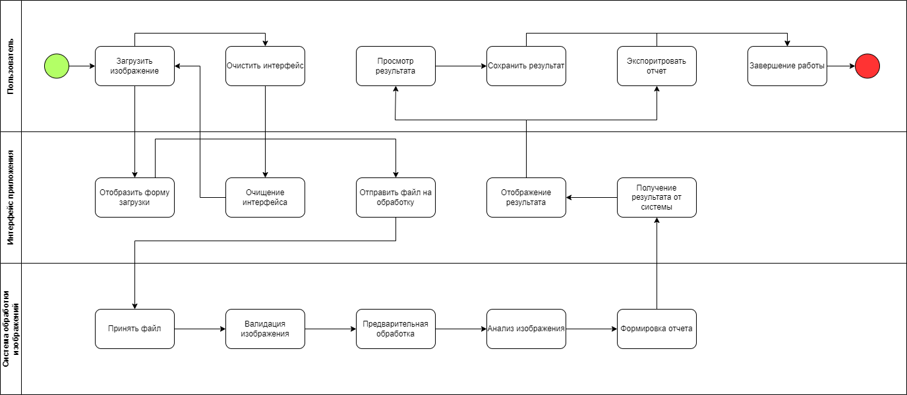
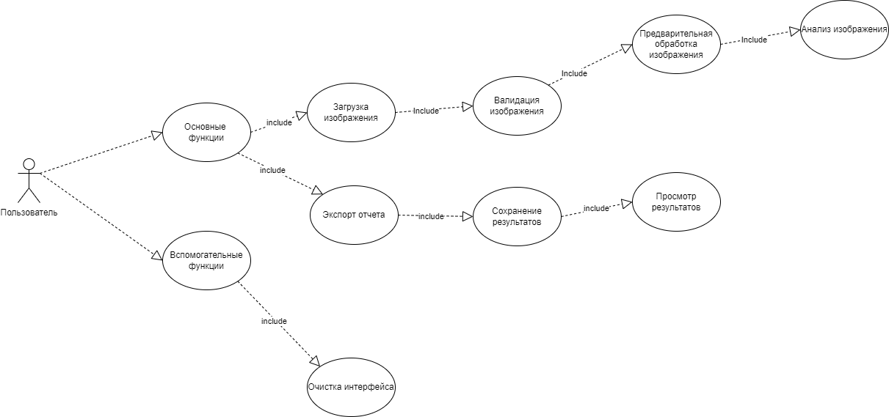
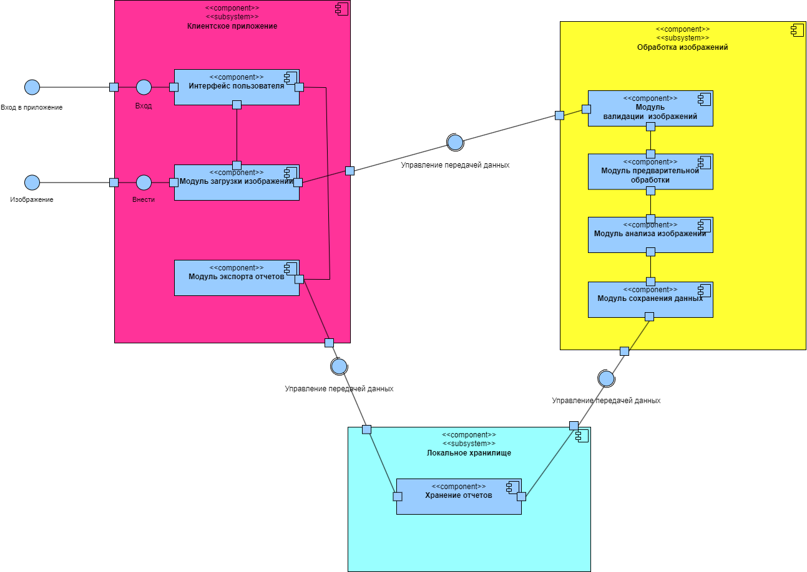
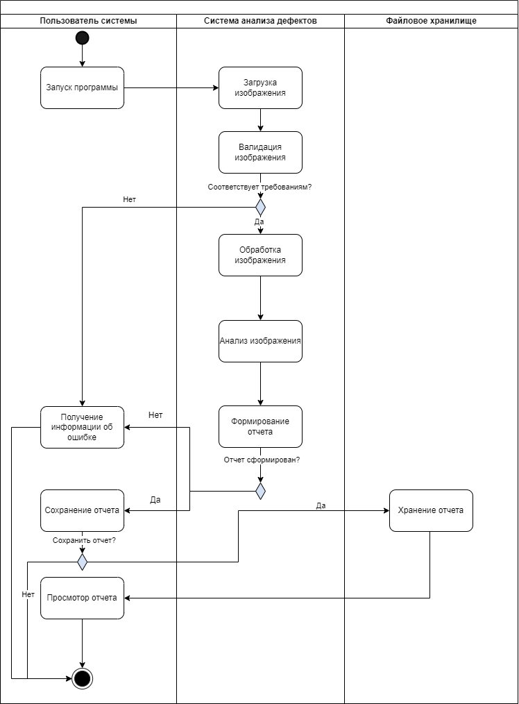
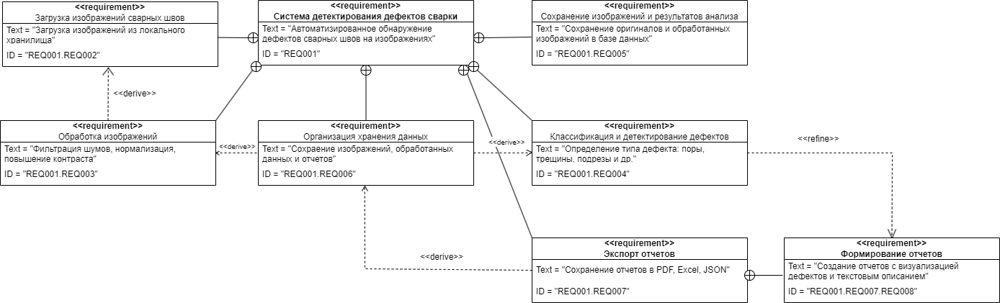
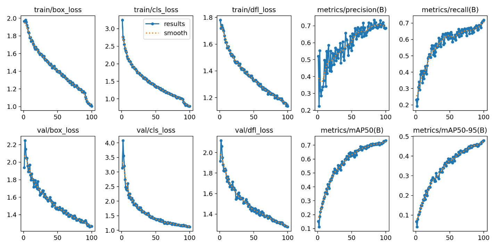
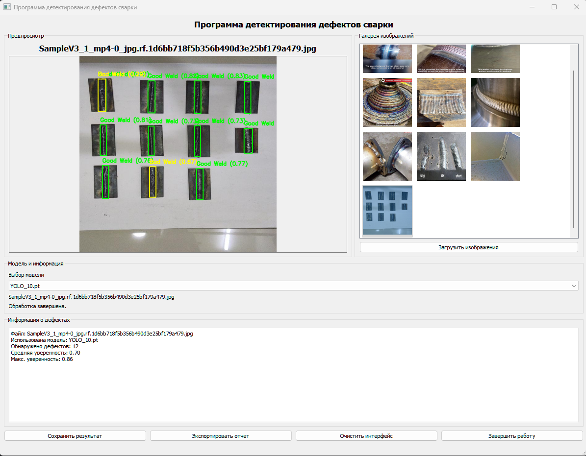
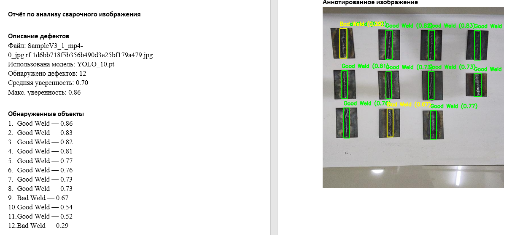

# Система детектирования дефектов сварных швов

## Постановка задачи
Качество сварных соединений напрямую влияет на надежность и долговечность конструкций. Ручная проверка сварки трудоёмка и подвержена человеческому фактору.  
Цель проекта — разработка локального приложения для автоматического обнаружения дефектов сварных швов по фотографиям с использованием методов компьютерного зрения и глубокого обучения.

## Краткое описание проекта
Разработанная система позволяет:
- Загружать изображения сварных соединений;
- Автоматически определять наличие дефектов на основе обученных моделей YOLO;
- Отображать результаты детектирования в графическом интерфейсе;
- Вести тестирование и валидацию модели на примерах.

Программа представляет собой десктопное приложение с удобным интерфейсом, в котором пользователь может анализировать качество сварки и получать результаты классификации.

##Диаграммы
##BPMN-диаграмма «to-be»

##UML-диаграмма прецедентов

##Диаграмма компонентов

##Последовательность взаимодействий

##Взаимосвязь между требованиями

## Используемые языки, библиотеки и технологии
- **Языки программирования**: Python  
- **Фреймворк для интерфейса**: PyQt5  
- **Модели компьютерного зрения**: YOLO (версии 8, 10, 11)  
- **Библиотеки**:  
  - `torch` (PyTorch) — работа с нейронными сетями  
  - `opencv-python` — обработка изображений  
  - `PIL` — работа с изображениями  
  - `pytest` — тестирование  
  - `numpy`, `matplotlib` — работа с массивами и графиками  

##Метрики после обучения

##Главное окно программы

##Экспортированный отчет

## Выводы по работе
В ходе работы была реализована локальная система для автоматического анализа сварных соединений.  
Приложение успешно интегрирует модели YOLO в графический интерфейс и позволяет наглядно демонстрировать результаты анализа.  
Проект может быть расширен для использования в реальном производстве, добавления базы данных дефектов и интеграции с промышленными системами контроля качества.
